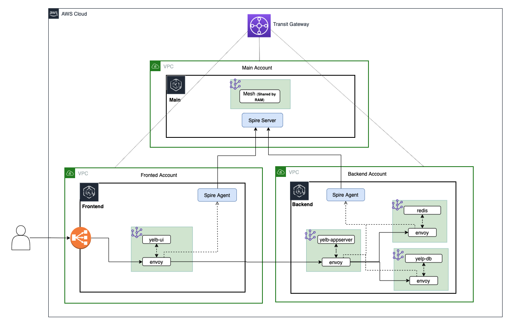

# eks-multi-account-spire

This repo contains all of the necessary artifacts to set up a single SPIRE trust domain across three distinct AWS accounts for mTLS communications using AWS Transit Gateway and AWS App Mesh.  The following architecture diagram illustrates the multi-account structure. 



Three EKS clusters are used in this multi-account environment, the main cluster (eks-cluster-shared) which hosts the SPIRE server, the frontend cluster (eks-cluster-frontend), and the backend cluster (eks-cluster-backend), both of which host the SPIRE agent.  

---

## Prerequisites:

This tutorial assumes that you are using a bash shell. Accordingly, you will need to ensure the following tools are installed:
- The [AWS CLI](https://docs.aws.amazon.com/cli/latest/userguide/cli-chap-install.html)
- The [eksctl](https://docs.aws.amazon.com/eks/latest/userguide/eksctl.html) utility used for creating and managing Kubernetes clusters on Amazon EKS 
- The [kubectl](https://docs.aws.amazon.com/eks/latest/userguide/install-kubectl.html) utility used for communicating with the Kubernetes cluster API server
- The [jq](https://stedolan.github.io/jq/) JSON processor
- The [Helm CLI](https://helm.sh/docs/intro/install/) used for installing [Helm Charts](https://helm.sh/docs/topics/charts/)
---
## Configuring the AWS CLI 
Three [named profiles](https://docs.aws.amazon.com/cli/latest/userguide/cli-configure-profiles.html) are used with the AWS CLI throughout this tutorial to target command executions at different accounts. After you have identified the three account you will use, ensure that you configure the following named profiles with [administrator access](https://docs.aws.amazon.com/IAM/latest/UserGuide/access_policies_job-functions.html#jf_administrator):
- a **shared** profile for the main account that will host the SPIRE server
- a **frontend** profile for the account that will host the frontend resources
- a **backend** profile for the account that will host the backend resources

These profiles are referenced in various commands and helper script throughout this tutorial, so ensure they are named exactly as specified, otherwise certain commands will fail. 

Your AWS CLI credentials and configurations should looks similar to the following example snippet: 

```bash
cat ~/.aws/credentials

[shared]
aws_access_key_id = ...
aws_secret_access_key = ...

[frontend]
aws_access_key_id =  ...
aws_secret_access_key = ...

[backend]
aws_access_key_id = ...
aws_secret_access_key = ...

cat ~/.aws/config

[profile shared]
region = us-east-2
output = json

[profile frontend]
region = us-east-2
output = json

[profile backend]
region = us-east-2
output = json
```
You can alternatively [configure the AWS CLI to use IAM roles](https://docs.aws.amazon.com/cli/latest/userguide/cli-configure-role.html) as well. 

---
## Deploying the CloudFormation Stacks

Start by deploying the shared services CloudFormation stack in the main account using the **shared** profile:

```bash
aws --profile shared cloudformation deploy \
 --template-file eks-multi-account-spire/cf-templates/shared-services-template.json \
 --stack-name eks-cluster-shared-services-stack \
 --capabilities CAPABILITY_NAMED_IAM \
 --parameter-overrides \
   FrontendAccountId=$(aws --profile frontend sts get-caller-identity | jq -r '.Account') \
   BackendAccountId=$(aws --profile backend sts get-caller-identity | jq -r '.Account')
```
This CloudFormation stack will create the following resources: 
- a new EKS cluster named **eks-cluster-shared** 

Now accept the RAM resource share for the frontend and backend accounts:

```bash 
aws --profile frontend ram accept-resource-share-invitation \
 --resource-share-invitation-arn $(aws --profile frontend ram get-resource-share-invitations \
 | jq -r '.resourceShareInvitations[] | select(.resourceShareName=="multi-account-tgw-share") | .resourceShareInvitationArn')

 aws --profile backend ram accept-resource-share-invitation \
 --resource-share-invitation-arn $(aws --profile backend ram get-resource-share-invitations \
 | jq -r '.resourceShareInvitations[] | select(.resourceShareName=="multi-account-tgw-share") | .resourceShareInvitationArn')
```

**Note:** If you are using accounts that belong to the same AWS Organization and you have [resource sharing](https://docs.aws.amazon.com/ram/latest/userguide/getting-started-sharing.html) enabled, this step is not necessary as principals in your organization get access to shared resources without exchanging invitations.

Next, deploy the frontend CloudFormation stack in the account you have designated to host your frontend resources using the **frontend** profile: 

```bash
aws --profile shared cloudformation deploy \
 --template-file eks-multi-account-spire/cf-templates/shared-services-template.json \
 --stack-name eks-cluster-shared-services-stack \
 --capabilities CAPABILITY_NAMED_IAM \
 --parameter-overrides \
   FrontendAccountId=$(aws --profile frontend sts get-caller-identity | jq -r '.Account') \
   BackendAccountId=$(aws --profile backend sts get-caller-identity | jq -r '.Account')
```
This CloudFormation stack will create the following resources: 
- a new EKS cluster named **eks-cluster-frontend** 

Finally, deploy the backend CloudFormation stack in the account you have designated to host your backend resources using the **backend** profile: 

```bash
aws --profile backend cloudformation deploy \
 --template-file eks-multi-account-spire/cf-templates/backend-template.json \
 --stack-name eks-cluster-backend-stack \
 --capabilities CAPABILITY_NAMED_IAM \
 --parameter-overrides \
   TransitGatewayId=$(aws --profile shared ec2 describe-transit-gateways \
   | jq -r '.TransitGateways[] | select(.Tags[].Value=="tgw-shared").TransitGatewayId') \
   NodeInstanceRoleArn=$(aws --profile shared iam list-roles \
   | jq -r '.Roles[] | select(.RoleName | contains("NodeInstanceRole")).Arn')
```
This CloudFormation stack will create the following resources: 
- a new EKS cluster named **eks-cluster-backend** 

---
## Update the kubectl Contexts
Now that the three EKS clusters are created, you will need to update your local **~/.kube/config** file to allow kubectl to communicate with the different API servers. For this, eksctl provides a utility command which allows you to obtain cluster credentials: 

```bash
eksctl --profile shared utils write-kubeconfig --cluster=eks-cluster-shared

eksctl --profile frontend utils write-kubeconfig --cluster=eks-cluster-frontend

eksctl --profile backend utils write-kubeconfig --cluster=eks-cluster-backend
```
By default, this command writes cluster credentials to your local **~/.kube/config** file.

For convenience, make a series of aliases to reference the different cluster [contexts](https://kubernetes.io/docs/concepts/configuration/organize-cluster-access-kubeconfig/#context): 

```bash 
echo export SHARED_CXT=$(kubectl config view -o json \
 | jq -r '.contexts[] | select(.name | contains("eks-cluster-shared")).name') >> ~/.bash_profile

echo export FRONT_CXT=$(kubectl config view -o json \
 | jq -r '.contexts[] | select(.name | contains("eks-cluster-frontend")).name') >> ~/.bash_profile
 
echo export BACK_CXT=$(kubectl config view -o json \
 | jq -r '.contexts[] | select(.name | contains("eks-cluster-backend")).name') >> ~/.bash_profile
 
 . ~/.bash_profile
```
As with the AWS CLI named profiles, these aliases are also referenced in various commands and helper script throughout this tutorial, so ensure they are named exactly as specified, otherwise certain commands will fail. 

---
## Modify the aws-auth ConfigMaps
The [aws-auth ConfigMap](https://docs.aws.amazon.com/eks/latest/userguide/add-user-role.html) allows your nodes to join your cluster and is also used to add [RBAC access](https://kubernetes.io/docs/reference/access-authn-authz/rbac/) to IAM users and roles. For this tutorial, the SPIRE server hosted in the main EKS cluster (**eks-cluster-shared**) requires authorization to get an authentication token for the frontend (**eks-cluster-frontend**) and backend (**eks-cluster-backend**) EKS clusters in order to verify the identities of the hosted SPIRE agents during [node attestation](https://spiffe.io/docs/latest/spire-about/spire-concepts/#node-attestation). To accomplish this, the SPIRE server will assume cross-account IAM roles, and these roles should be added to the aws-auth ConfigMap of the frontend and backend EKS clusters. 

Execute the following commands to edit the frontend aws-auth ConfigMap:
```bash 
kubectl config use-context $FRONT_CXT

kubectl edit cm -n kube-system aws-auth 
```
Add the following to the aws-auth ConfigMap under mapRoles, replacing \<account-id> with the frontend account ID:
```bash 
- groups: 
    - system:masters
  rolearn: arn:aws:iam::<account-id>:role/eks-cluster-frontend-access-role
  username: eks-cluster-frontend-access-role
```

Execute the folliwng commands to edit the backend aws-auth ConfigMap: 
```bash
kubectl config use-context $BACK_CXT

kubectl edit cm -n kube-system aws-auth
```
Add the following to the aws-auth ConfigMap under mapRoles, replacing \<account-id> with the backend account ID:
```bash
- groups: 
    - system:masters
  rolearn: arn:aws:iam::<account-id>:role/eks-cluster-backend-access-role
  username: eks-cluster-backend-access-role
```
**Note:** Press the “i” key to enter insert mode, the “esc” key to exit insert mode, and “:wq!” to save your changes. Also remember to use spaces instead of tabs to implement the appropriate indentation as YAML does not support tabs. 

You can verify the updates by executing the following command: 
```bash
kubectl describe cm -n kube-system aws-auth
```
---
## Create the App Mesh Service Mesh and Cloud Map Namespace
Run the following helper script to install the appmesh-controller in each EKS cluster, create an AWS App Mesh service mesh (**am-multi-account-mesh**) in the main account, share the service mesh with the frontend and backend accounts, and create an AWS Cloud Map namespace (**am-multi-account.local**) in the backend account: 
```bash 
./eks-multi-account-spire/helper-scripts/app_mesh_setup.sh
```
This helper script also creates a **yelb** namespace in each EKS cluster and labels it with the following key value pairs: 
- mesh=am-multi-account-mesh 
- "appmesh.k8s.aws/sidecarInjectorWebhook"=enabled

These labels are required to 

The AWS Cloud Map namespace in the backend account is used for service discovery between the yelb-ui virtual node that will be created in the frontend account and the yelb-appserver virtual service that will be created in the backend account. 